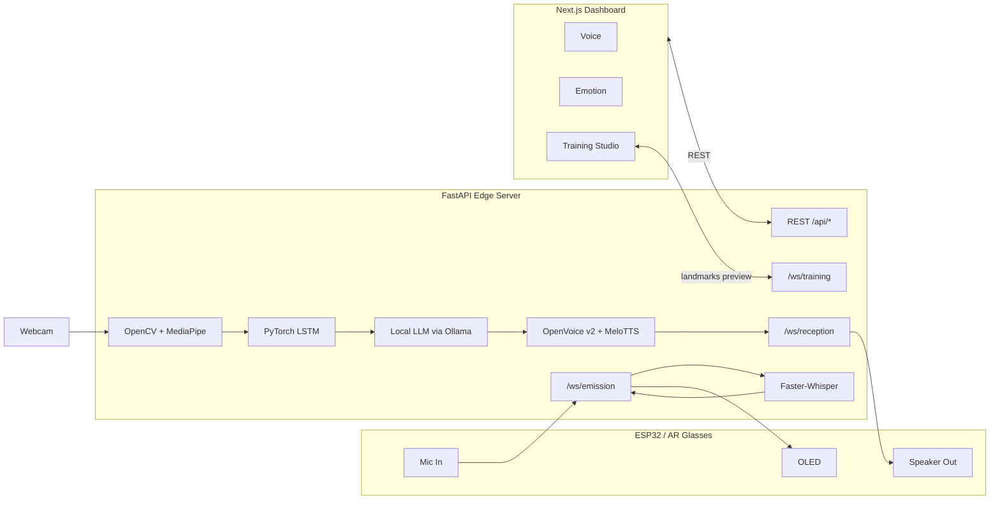

# AR Glasses Sign-Speech Bridge

Edge server + companion dashboard for a pair of AR glasses that lets a Deaf/Mute
user and a hearing user converse in real time. The system runs two
ultra-low-latency WebSocket pipelines and exposes REST endpoints for the
client app to configure voice cloning, emotional tone, and a Sign Language
Training Studio.

## Architecture



### Pipeline I — Reception (Deaf user signs → glasses speak)

1. `cv2.VideoCapture` produces frames on the Edge server.
2. **MediaPipe Hands** extracts 21 3D landmarks per hand.
3. A 30-frame **PyTorch LSTM** classifies a gesture token; tokens accumulate
   into a phrase until the signer pauses (~1s).
4. A **local LLM** (Ollama, e.g. `llama3.2` or
   `qwen2.5:3b-instruct`) translates the gloss tokens into a natural sentence,
   token-streamed back as it generates. Ollama auto-detects CUDA / Metal /
   ROCm and uses the GPU when one is available.
5. **OpenVoice v2 (MyShell)** runs locally:
   - **MeloTTS** synthesises the sentence in the configured language/speaker
     (with `speed` derived from the emotion preset + intensity).
   - **ToneColorConverter** swaps the timbre to the user's cloned voice using
     a tone embedding pre-extracted from a 6-second reference sample.
   - Output is resampled to 16-bit PCM @ 16 kHz and streamed in 4 KB frames.
6. Bytes are forwarded **as they arrive** to the ESP32 via
   `/ws/reception/{device_id}`.

### Pipeline II — Emission (Hearing user speaks → glasses display)

1. ESP32 streams 16-bit PCM @ 16 kHz over `/ws/emission/{device_id}`.
2. The server buffers audio into 1.5s windows and pushes them through
   **Faster-Whisper** (`small`, `int8` by default — fully local, no API
   calls; uses CUDA when available, falls back to CPU otherwise).
3. The transcript is sent back as JSON for the OLED screen to render
   **and** fan-out broadcast to any dashboard tab subscribed to
   `/ws/transcripts/{device_id}` so the **/live** page can show live
   captions in the browser.

> If the ESP32 is wired over **USB-CDC** instead of Wi-Fi (the included
> ESP32-S2 sketch sends 8-bit PCM @ 16 kHz with `[AUDIO_START]` /
> `[AUDIO_STOP]` ASCII markers), use the bundled USB-serial bridge —
> see [USB-serial bridge](#usb-serial-bridge-esp32-over-usb) below. It
> connects to both `/ws/emission` (mic-in) and `/ws/reception`
> (TTS-out) for you, so no firmware change is needed.

### Latency strategy (target < 300 ms)

- All I/O on `asyncio`; CPU-bound MediaPipe / LSTM / OpenVoice run via
  `asyncio.to_thread`.
- LLM **token streaming** is buffered into sentence-sized chunks (the smallest
  unit OpenVoice can synthesise), then each chunk's PCM output is split into
  4 KB frames and forwarded to the WS as it's produced.
- OpenVoice + MeloTTS are **pre-loaded at startup** so the first request
  doesn't pay the model-load cost. Tone embeddings for cloned voices are
  cached in memory after the first use.
- Faster-Whisper VAD-gated with 200ms silence threshold, beam_size=1.
- Per-device bounded queues drop the oldest frame on back-pressure rather
  than blocking the producer.

> Note on hardware: OpenVoice on **CPU** typically synthesises ~0.5-1× realtime
> per sentence, which can exceed the 300 ms phrase budget. A consumer GPU
> (CUDA) brings this down to roughly 5-10× realtime and is recommended for
> live use. The pipeline degrades gracefully on CPU — phrases just play with
> a longer initial delay.

## Project layout

```
full_project/
├── server/    FastAPI Edge server (Python 3.11+)
├── client/    Next.js 14 + Tailwind dashboard
├── mobile/    Expo stub for the future React Native app
├── README.md
└── .gitignore
```

## Running locally

### Prerequisites

- Python **3.11+** (the server uses `asyncio.TaskGroup` / `except*`)
- Node **20+**
- A webcam connected to the machine running the server
- **ffmpeg** on `PATH` (used by OpenVoice's reference-audio extractor)
- An NVIDIA GPU with CUDA is strongly recommended for live use, but CPU works
- [Ollama](https://ollama.com) installed with a small instruction model
  pulled (e.g. `ollama pull llama3.2`). Voice synthesis is also
  fully local via OpenVoice — **no API keys required.**

### Server

```bash
cd server
python -m venv .venv
.venv\Scripts\activate          # PowerShell:  .\.venv\Scripts\Activate.ps1

pip install -r requirements.txt

# OpenVoice / MeloTTS post-install steps:
python -m unidic download

# Download the OpenVoice v2 checkpoints (~500 MB) and unzip into
# server/models/openvoice_v2 so that the layout looks like:
#   server/models/openvoice_v2/converter/{config.json,checkpoint.pth}
#   server/models/openvoice_v2/base_speakers/ses/<speaker>.pth
# Latest archive: https://myshell-public-repo-host.s3.amazonaws.com/openvoice/checkpoints_v2_0417.zip

copy .env.example .env          # tweak OLLAMA_MODEL / OLLAMA_NUM_GPU if needed
ollama pull llama3.2
uvicorn app.main:app --reload --host 0.0.0.0 --port 8000
```

Visit `http://localhost:8000/docs` for the OpenAPI explorer.

> If the OpenVoice checkpoints aren't present yet, the server still boots —
> the TTS adapter logs a warning and emits silence on `/ws/reception` so you
> can verify the rest of the pipeline first, then add the checkpoints later.

### Client

```bash
cd client
npm install
copy .env.example .env.local
npm run dev   # http://localhost:3000
```

## REST endpoints (companion app)

| Method | Path                                  | Purpose                                  |
| ------ | ------------------------------------- | ---------------------------------------- |
| GET    | `/api/health`                         | liveness                                 |
| GET    | `/api/voice/profiles`                 | list voice profiles                      |
| PUT    | `/api/voice/profiles/active`          | switch the active voice                  |
| POST   | `/api/voice/clone`                    | upload 6-second sample → local `voice_id` (audio + tone embedding stored under `data/voices/`) |
| GET    | `/api/emotion`                        | get tone preset + intensity              |
| PUT    | `/api/emotion`                        | set tone preset + intensity              |
| POST   | `/api/training/start`                 | begin a labelled capture session         |
| POST   | `/api/training/stop`                  | end a labelled capture session           |
| GET    | `/api/training/samples`               | per-label sample counts                  |
| POST   | `/api/training/train`                 | kick off LSTM fine-tune (background)     |
| POST   | `/api/training/load-default-pack`     | install/curate default sign pack         |

## WebSocket endpoints (ESP32 + dashboard)

| Path                                | Direction                            | Wire format                                                    |
| ----------------------------------- | ------------------------------------ | -------------------------------------------------------------- |
| `/ws/reception/{device_id}`         | server → ES                          | binary audio frames + JSON status (`gesture`, `phrase`, `audio_end`) |
| `/ws/emission/{device_id}`          | ES → server, server → ES             | binary PCM in; `{type:"transcript", text, final}` JSON out     |
| `/ws/transcripts/{device_id}`       | server → dashboard browser           | read-only fan-out of every `/ws/emission/{device_id}` JSON event (`status`, `transcript`, `error`); used by **/live** to render captions in real time |
| `/ws/training/{session_id}`         | dashboard ↔ server                   | server: `{type:"landmarks", frame, ts}`; client: action JSONs  |

Training Studio actions:

```jsonc
{ "action": "start_capture", "label": "hello" }
{ "action": "stop_capture" }
{ "action": "save_sample" }   // snapshot the current 30-frame window
```

## USB-serial bridge (ESP32 over USB)

The Arduino sketch shipped for the ESP32-S2 talks to the host over USB-CDC
at 460800 baud, sending raw 8-bit unsigned PCM samples while the
microphone is active and accepting the same format back to drive the
DAC-connected speaker. To plug that into the existing WebSocket
pipelines (and therefore Faster-Whisper for STT and OpenVoice for TTS)
the server ships a small standalone bridge:
[`server/scripts/serial_bridge.py`](server/scripts/serial_bridge.py).

What it does:

- Reads from the COM port and demultiplexes the mixed stream of binary
  audio + ASCII control lines (`[AUDIO_START]` / `[AUDIO_STOP]`).
- Converts mic samples from uint8 → int16 PCM, batches them into 64 ms
  WS frames, and sends them on `/ws/emission/{device_id}`. Transcripts
  arrive back as JSON and are printed (and optionally appended to a log
  file).
- Subscribes to `/ws/reception/{device_id}`, converts incoming int16
  PCM back to uint8, and writes it to the COM port paced at ~16 KB/s
  so the ESP32's small USB-CDC RX buffer doesn't overflow. The sketch's
  `dacWrite(SPEAKER_PIN, Serial.read())` then plays it.

```bash
# 1) Find your ESP32-S2 COM port
python -c "import serial.tools.list_ports as p; [print(x) for x in p.comports()]"

# 2) Make sure the FastAPI server is already running on :8000.
# 3) Start the bridge (auto-detects the Espressif port if --port omitted)
cd server
python -m scripts.serial_bridge --port COM5 --device-id glasses-01
```

Useful flags:

| Flag                         | Purpose                                                  |
| ---------------------------- | -------------------------------------------------------- |
| `--port COM5` / `/dev/ttyACM0` | Force a specific serial port                          |
| `--server ws://host:8000`    | Point at a non-default FastAPI host                      |
| `--device-id glasses-01`     | Logical id used in the WS path (must match dashboard)    |
| `--no-stt`                   | Skip the mic-in WS (debug TTS-only path)                 |
| `--no-tts`                   | Skip the TTS-out WS (debug mic-only path)                |
| `--log-transcripts data/transcripts.log` | Append every final transcript line to a file |
| `-v`                         | Debug logging (per-mode toggles, gestures, etc.)         |

The bridge is intentionally minimal and does **not** trigger TTS by
itself — the speaker plays whatever the existing reception pipeline
emits (gestures → LLM → OpenVoice). For ad-hoc text → speaker, call
`POST /api/voice/synthesize` and you can wire its WAV output to the
same serial port without changing the sketch.

> The current sketch interleaves binary audio bytes with `Serial.println`
> debug strings on the same TX pipe; the bridge handles this with
> sentinel scanning, but the protocol would be more robust with an
> explicit framing byte (e.g. `0xA1` before each audio burst, `0xA0` to
> stop). Worth doing if you ever see audio glitches that correlate with
> debug output.

## Notes & next steps

- The repo ships **without** a trained LSTM checkpoint. The classifier
  silently returns `None` until you record samples in the Training Studio
  and click **Train LSTM**.
- The default sign pack endpoint is a stub returning a manifest; wire it to
  a download/extract step when a curated dataset is ready.
- For deployment, add a Dockerfile per service and a `docker-compose.yml`.
- Authentication and multi-device sessions are intentionally out of scope
  for this single-user prototype.
